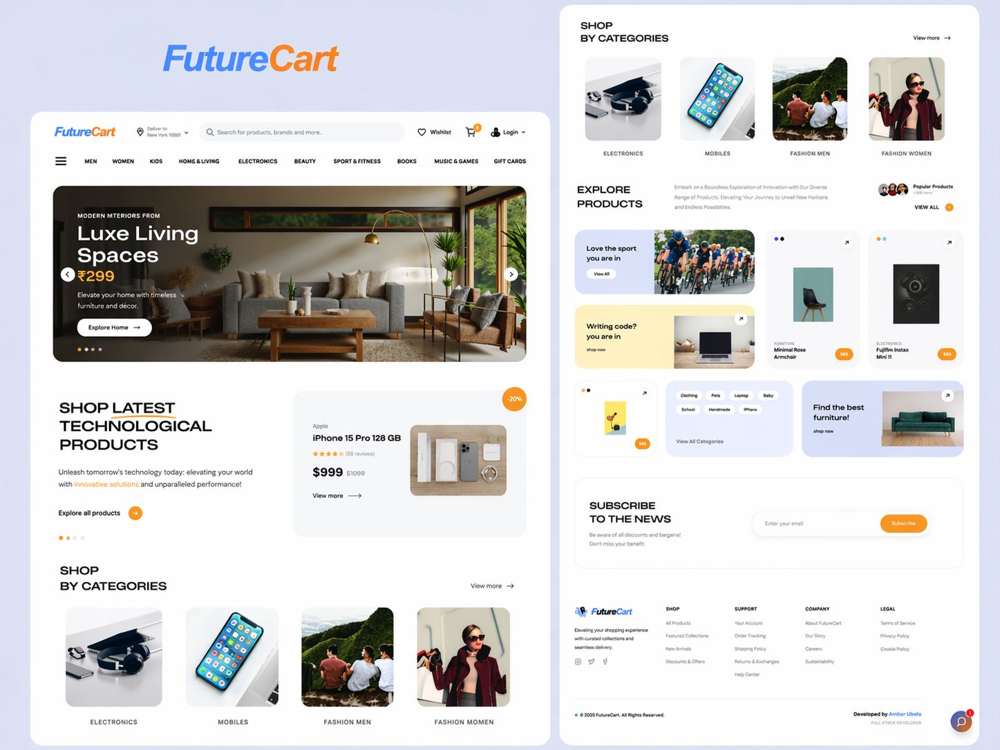
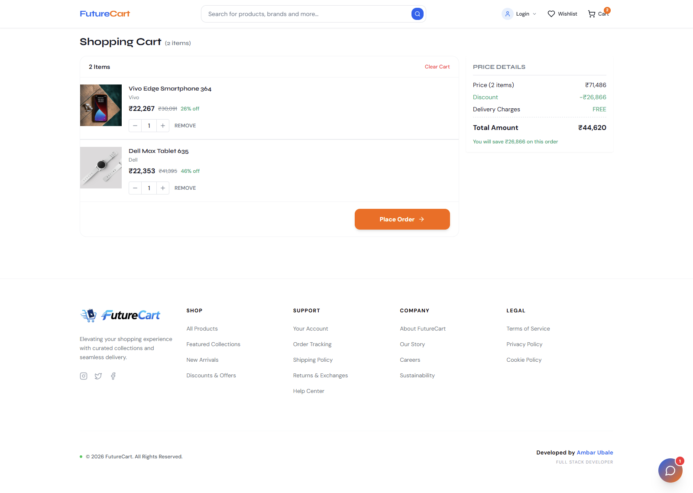

# 🛒 FutureCart — Modern eCommerce Platform

<div align="center">


**A full-stack, feature-rich eCommerce platform built with React, TypeScript, and Supabase.**

[](https://your-deploy-link.vercel.app)
[](https://reactjs.org/)
[](https://www.typescriptlang.org/)
[](https://supabase.com/)
[](https://vitejs.dev/)
[](https://tailwindcss.com/)

</div>

---

# 🌐 Live Demo

> 🔗 Deployment link will be added here

---

# 📸 Screenshots

## 🏠 Homepage UI



## 🛒 Cart & Checkout



---

# ✨ Features

## 🛍️ Shopping Experience

- Product browsing with modern UI
- Advanced filtering (category, price, rating, discount)
- Full-text smart search
- Product detail with gallery & highlights
- Deals & trending sections
- Category-based navigation

---

## 🧺 Cart & Checkout

- Persistent cart (Context API)
- Wishlist system
- Smooth checkout flow
- Payment integration via backend function
- Order tracking system
- Payment success page

---

## 👤 Auth & User System

- Signup / Login (Supabase Auth)
- Session management
- Profile page
- Recently viewed products tracking

---

## 🧑‍💼 Seller Features

- Seller dashboard
- Add & manage products
- Products go through admin approval

---

## 🛡️ Admin Features

- Admin dashboard
- Approve / reject products
- Full marketplace control

---

## ⚡ Real-Time System (🔥 Core Highlight)

- Powered by Supabase Realtime
- Instant updates when:
  - Product approved
  - Product updated
  - Product deleted

- No refresh needed → smooth UX

---

## 🤖 UI & UX Enhancements

- ChatBot integration
- Toast notifications (Sonner)
- Smooth animations (Framer Motion)
- Back-to-top button
- Responsive design (mobile + desktop)

---

# 🧠 System Architecture

## 🔥 Dynamic Product Engine

FutureCart uses a **fully dynamic Supabase-powered product system**:

- Products stored in Supabase database
- Sellers add products
- Admin controls visibility via approval system
- ProductsContext manages global state
- UI auto-syncs with database changes

---

## 🔄 Real-Time Flow

```text
Seller adds product → Admin approves → Supabase event → UI updates instantly
```

---

## 🧩 State Management

| Context               | Purpose            |
| --------------------- | ------------------ |
| AuthContext           | Authentication     |
| CartContext           | Cart state         |
| WishlistContext       | Wishlist           |
| ProductsContext       | Product management |
| RecentlyViewedContext | User tracking      |

---

# 🔍 Product System Deep Dive

## ProductsContext Responsibilities:

- Fetch products from Supabase
- Maintain global product state
- Subscribe to realtime updates
- Sync UI instantly
- Provide helper methods:
  - getProductById()
  - searchProducts()
  - getDealsOfTheDay()
  - getTopOffers()
  - getTrendingProducts()

---

## 🧪 Database Query Layer

Supports:

- Filtering (price, category, rating)
- Sorting (price, rating, discount)
- Pagination
- Full-text search

---

# 🔐 Authentication

- Powered by Supabase Auth
- Email/password login system
- Persistent sessions

---

# 🛒 Checkout Flow

1. Add product to cart
2. Navigate to checkout
3. Backend function triggered
4. Payment processed
5. Redirect to success page

---

# 🛠 Tech Stack

## Frontend

- React 18 + TypeScript
- Vite
- Tailwind CSS + shadcn/ui
- Framer Motion

## Backend

- Supabase (Database + Auth + Realtime)

## State & Data

- Context API
- React Query

## UI Libraries

- Radix UI
- Lucide Icons
- Sonner

## Testing

- Vitest
- Playwright

---

# 📂 Project Structure

```
src/
 ├── components/
 ├── contexts/
 ├── pages/
 ├── hooks/
 ├── lib/
 ├── integrations/
 └── data/

supabase/
 ├── functions/
 └── migrations/
```

---

# 🚀 Getting Started

## 1. Clone Repo

```bash
git clone https://github.com/your-username/futurecart.git
cd futurecart
```

## 2. Install Dependencies

```bash
npm install
```

## 3. Setup Environment Variables

```env
VITE_SUPABASE_URL=your_url
VITE_SUPABASE_ANON_KEY=your_key
```

---

## 4. Run Project

```bash
npm run dev
```

---

## 5. Build Project

```bash
npm run build
```

---

# 📜 Scripts

| Command         | Description      |
| --------------- | ---------------- |
| npm run dev     | Start dev server |
| npm run build   | Production build |
| npm run preview | Preview build    |
| npm run lint    | Lint code        |
| npm run test    | Run tests        |

---

# ☁️ Deployment

Deploy easily on:

- Vercel
- Netlify

---

# 🔮 Future Improvements

- Payment gateway (Stripe / Razorpay)
- Order history page
- Reviews & ratings
- AI recommendations
- PWA support

---

# 🤝 Contributing

1. Fork repo
2. Create branch
3. Commit changes
4. Open PR

---

# 📄 License

MIT License

---

# 👨‍💻 Author

**Ambar Ubale**

---

🔥 _FutureCart is a modern, scalable, real-time eCommerce platform built for production-level applications._
